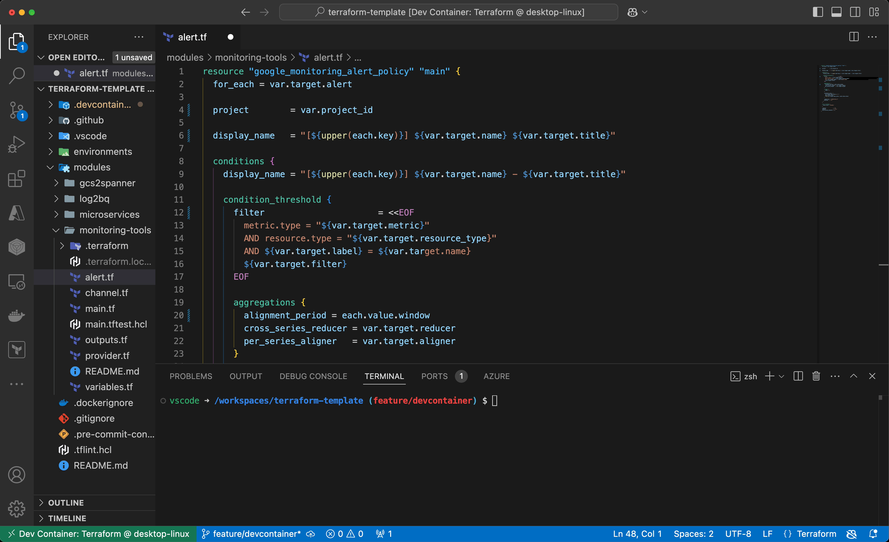

# Terraform Development with VSCode Dev Container

<div align="center">

[](https://github.com/hashicorp/terraform)

[](https://github.com/a5chin/terraform-template/actions/workflows/docker.yml)
[](https://github.com/a5chin/terraform-template/actions/workflows/terraform.yml)

</div>

## Overview
This repository contains configurations to set up a Terraform development environment using VSCode's Dev Container feature.



If the Terraform format does not work, try reloading the VS Code window.
Specifically, you can solve this problem by following the steps below.

1. Type `⌘+⇧+P` to open the command palette
2. Type `Developer: Reload Window` in the command palette to reload the window

### Contents
- [Terraform Development with VSCode Dev Container](#terraform-development-with-vscode-dev-container)
  - [Overview](#overview)
    - [Contents](#contents)
  - [Settings](#settings)
  - [Dev Container](#dev-container)
  - [GitHub Actions](#github-actions)
  - [pre-commit](#pre-commit)
  - [Appendix](#appendix)
    - [The structure of this repository](#the-structure-of-this-repository)

## Settings
- files.insertFinalNewline
- files.trimTrailingWhitespace
- editor.formatOnSave
  - dockercompose
  - dockerfile
  - github-actions-workflow
  - json, jsonc
  - terraform
  - yaml

## Dev Container
- `devcontainer.json`
  - features
    - hadolint
    - pre-commit
    - terraform-docs
  - extentions
    - [aquasecurityofficial.trivy-vulnerability-scanner](https://marketplace.visualstudio.com/items?itemName=aquasecurityofficial.trivy-vulnerability-scanner)
    - [codezombiech.gitignore](https://marketplace.visualstudio.com/items?itemName=codezombiech.gitignore)
    - [eamodio.gitlens](https://marketplace.visualstudio.com/items?itemName=eamodio.gitlens)
    - [exiasr.hadolint](https://marketplace.visualstudio.com/items?itemName=exiasr.hadolint)
    - [hashicorp.terraform](https://marketplace.visualstudio.com/items?itemName=hashicorp.terraform)
    - [mosapride.zenkaku](https://marketplace.visualstudio.com/items?itemName=mosapride.zenkaku)
    - [ms-azuretools.vscode-docker](https://marketplace.visualstudio.com/items?itemName=ms-azuretools.vscode-docker)
    - [ms-vscode-remote.remote-containers](https://marketplace.visualstudio.com/items?itemName=ms-vscode-remote.remote-containers)
    - [oderwat.indent-rainbow](https://marketplace.visualstudio.com/items?itemName=oderwat.indent-rainbow)
    - [pkief.material-icon-theme](https://marketplace.visualstudio.com/items?itemName=pkief.material-icon-theme)
    - [redhat.vscode-yaml](https://marketplace.visualstudio.com/items?itemName=redhat.vscode-yaml)
    - [shardulm94.trailing-spaces](https://marketplace.visualstudio.com/items?itemName=shardulm94.trailing-spaces)
    - [usernamehw.errorlens](https://marketplace.visualstudio.com/items?itemName=usernamehw.errorlens)
    - [yzhang.markdown-all-in-one](https://marketplace.visualstudio.com/items?itemName=yzhang.markdown-all-in-one)
- `Dockerfile`
    - tenv
    - trivy
    - google cloud

## GitHub Actions
- `docker.yml`
  - Workflow to check if you can build with Docker
- `terraform.yml`
  - Workflow to check
    - format
    - lint
    - test
    - validation

## pre-commit
The `.pre-commit-config.yaml` file can contain scripts to be executed before commit.

```sh
# Terraform Formatter
terraform fmt .

# Terraform Linter
tflint --recursive

# Terraform Docs
terraform-docs markdown table --output-file README.md --output-mode inject /path/to/module
```

## Appendix

### The structure of this repository
```
.
├── .devcontainer
│   ├── devcontainer.json
│   └── Dockerfile
├── .github
│   └── workflows
│       └── terraform.yml
├── .vscode
│   ├── extensions.json
│   └── settings.json
├── environments
│   ├── dev
│   │   ├── .terraform-version
│   │   ├── backend.tf
│   │   ├── main.tf
│   │   ├── outputs.tf
│   │   ├── provider.tf
│   │   └── versions.tf
│   ├── prod
│   │   ├── .terraform-version
│   │   ├── backend.tf
│   │   ├── main.tf
│   │   ├── outputs.tf
│   │   ├── provider.tf
│   │   └── versions.tf
│   └── stg
│       ├── .terraform-version
│       ├── backend.tf
│       ├── main.tf
│       ├── outputs.tf
│       ├── provider.tf
│       └── versions.tf
└── modules
│   ├── gcs2spanner
│   │   ├── README.md
│   │   ├── architecture.drawio.svg
│   │   ├── functoins.tf
│   │   ├── main.tf
│   │   ├── main.tftest.hcl
│   │   ├── outputs.tf
│   │   ├── provider.tf
│   │   ├── scheduler.tf
│   │   ├── src
│   │   │   ├── main.py
│   │   │   └── requirements.txt
│   │   ├── variables.tf
│   ├── gcs2spanner
│   │   ├── README.md
│   │   ├── architecture.drawio.svg
│   │   ├── dataflow.tf
│   │   ├── functoins.tf
│   │   ├── gcs.tf
│   │   ├── main.tf
│   │   ├── main.tftest.hcl
│   │   ├── outputs.tf
│   │   ├── provider.tf
│   │   ├── sa.tf
│   │   ├── src
│   │   │   ├── authz.py
│   │   │   ├── extract.py
│   │   │   ├── logger.py
│   │   │   ├── main.py
│   │   │   ├── requirements.txt
│   │   │   └── tests
│   │   │       └── test_extract.py
│   │   ├── variables.tf
│   │   └── vpc.tf
│   ├── log2bq
│   │   ├── README.md
│   │   ├── bigquery.tf
│   │   ├── logging.tf
│   │   ├── main.tf
│   │   ├── outputs.tf
│   │   ├── provider.tf
│   │   └── variables.tf
│   ├── microservices
│   │   ├── README.md
│   │   ├── architecture.drawio.svg
│   │   ├── backend.tf
│   │   ├── db.tf
│   │   ├── frontend.tf
│   │   ├── main.tf
│   │   ├── outputs.tf
│   │   ├── provider.tf
│   │   ├── variables.tf
│   │   └── vpc.tf
│   └── monitoring-tools
│       ├── README.md
│       ├── alert.tf
│       ├── channel.tf
│       ├── main.tf
│       ├── main.tftest.hcl
│       ├── outputs.tf
│       ├── provider.tf
│       └── variables.tf
├── .dockerignore
├── .gitignore
├── .pre-commit-config.yaml
├── .tflint.hcl
├── .tool-versions
└── README.md
```
